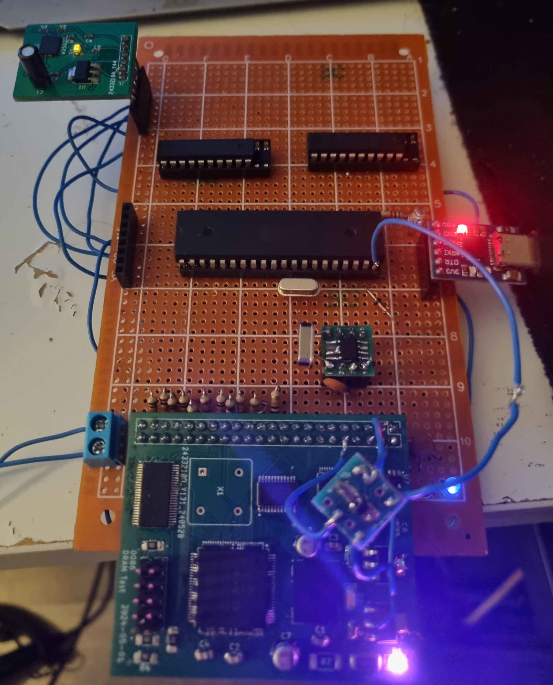

# arv32-opt

## What is this?
This is a fork of of [arv32-opt](https://github.com/raspiduino/arv32-opt), but much, much faster. Using my [mini DDR2 controller](https://github.com/89Mods/mini-ddr2) for fast memory (a appropriately sized SRAM chip could also be used) and a 25Q128 spiflash to hold the RAM image, the RISC-V emulator is sped up by orders of magnitude.

My setup boots to the bash prompt in **under 40 minutes** and is very usable afterwards, with keystrokes registering in one second or less.

I am hoping to get this down to less than 30 minutes with further optimization and a higher clock speed on the AVR.



## Usage
### Preparing the spiflash
- First, you will need a 25Q128 spiflash and some way to connect it to a programmer and then the AVR. Its a 3.3V part, but simple resistor voltage dividers work as good enough level shifters (though I recommend diode + pull-up resistor approach).
- Download the file [`arv32.bin`](https://github.com/raspiduino/arv32-opt/raw/main/rv32.bin) file. FYI, this file is generated by dumping `mini-rv32ima` emulator's RAM array to a file when it just finished loading the kernel and stuffs (but has not boot). You can generate your own version for newer updates of Linux kernel or Buildroot.
- Flash this directly onto the spiflash

I recommend using [this](https://protosupplies.com/product/pcb-smd-soic-8-msop-8-tssop-8-to-dip-adapter5-pack/) breakout board (the 25Q128 comes only in SMD) and the [CH341A](https://www.amazon.com/Programmer-Module-CH341A-Burner-5V-3-3V/dp/B07PFCJ8G9) programmer, as it is supported by the `flashrom` utility on Linux.

### Building the code
- First, clone the repo: `git clone https://github.com/89Mods/arv32-opt`. Then `cd arv32-opt`
- Then use build the code using the following commands:
```cmd
make clean
make
```
- Result HEX file will be `main.hex`
- The command to flash it will differ depending on your hardware setup. Mine is `avrdude -p m32 -P /dev/ttyS0 -c ponyser -U flash:w:main.hex:i`

> [!IMPORTANT]  
> If you build for another AVR microcontroller, or if you use different clock speed, please change the `-mmcu=atmega32` and `-DF_CPU=20000000UL` options in the Makefile to match your situation.

## Credits
- [cnlohr](https://github.com/cnlohr) for writing [mini-rv32ima](https://github.com/cnlohr/mini-rv32ima/).
- [ryanj1234](https://github.com/ryanj1234) for writing [SD_TUTORIAL_PART4](https://github.com/ryanj1234/SD_TUTORIAL_PART4).
- [adnbr](https://github.com/adnbr/) for writing [1 ms counter](https://gist.github.com/adnbr/2439125)
- [(gvl610/raspiduino)](https://github.com/raspiduino) for bringing all this stuff together.
